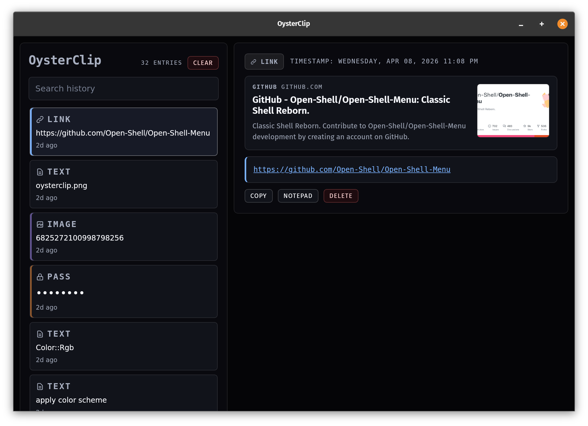
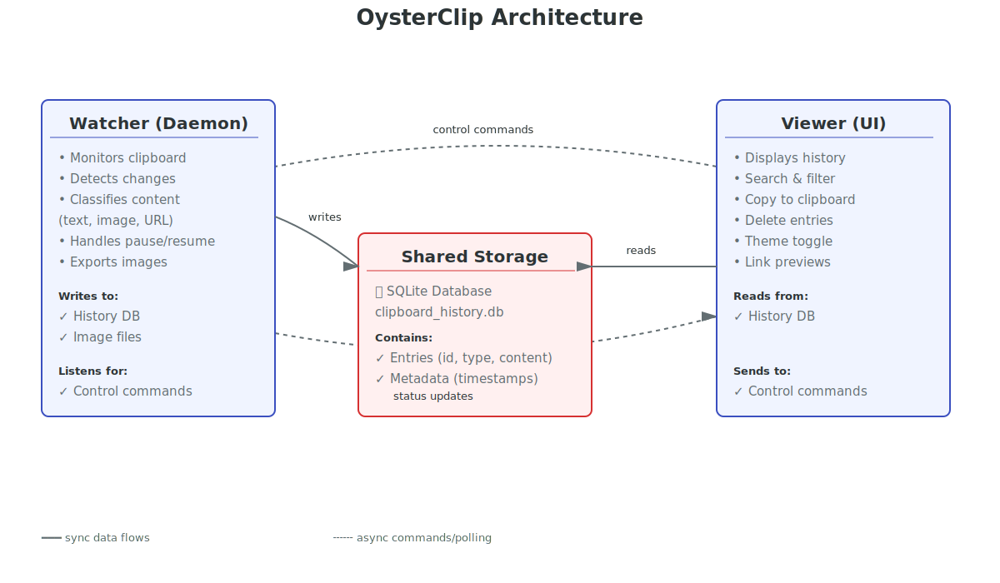

# OysterClip



This is my clipboard manager. There are many like it, but this one is mine (and now yours).

A lightweight, secure clipboard history manager for Unix/Linux and macOS. **OysterClip** consists of a background watcher daemon that captures clipboard entries to an encrypted database, paired with a powerful desktop UI and terminal-based viewer for searching and managing your clipboard history.

<details>
  <summary>Architecture diagram</summary>
  <p></p>
</details>

## Components

### Watcher (`packages/oysterclip-watcher`)

A daemon that monitors your system clipboard and persists entries to SQLite with encryption.

**Features:**
- Clipboard polling on 500ms interval
- XChaCha20Poly1305 encryption at rest
- Image storage as PNG blobs
- Automatic text deduplication
- Unix socket control API (pause/resume/status)
- OS keychain integration for secure key storage

```bash
cargo run -p oysterclip-watcher
cargo run -p oysterclip-watcher -- control status
```

See [`packages/oysterclip-watcher/README.md`](packages/oysterclip-watcher/README.md) for details.

### Viewer (`packages/oysterclip-viewer`)

A Dioxus Desktop app for browsing, searching, and managing clipboard history.

**Features:**
- Keyboard-driven navigation (↑↓ hjkl, Home/End)
- Structured search: `type:image`, `kind:url`, `since:1h`
- Copy/delete/clear history
- Dark/light theme
- Password masking with auth caching
- URL previews and clickable links
- Multi-select bulk operations

```bash
cargo run -p oysterclip-viewer
cargo run -p oysterclip-viewer -- --theme light
```

See [`packages/oysterclip-viewer/README.md`](packages/oysterclip-viewer/README.md) for details.

### Terminal UI (`packages/oysterclip-tui`)

A simple terminal interface for clipboard history on headless servers and SSH sessions.

**Features:**
- Browse clipboard history (last 100 entries)
- View full content of selected entries
- Arrow key navigation
- Integrated with the same database as viewer/watcher
- Independent operation (doesn't require watcher daemon)

```bash
cargo run -p oysterclip-tui
```

See [`packages/oysterclip-tui/README.md`](packages/oysterclip-tui/README.md) for details.

## Quick Start

**Requirements:** Rust 1.70+, GTK 3.24+ (Linux), macOS 10.13+ (macOS)

```bash
# Start the watcher daemon
cargo run -p oysterclip-watcher &

# Launch the viewer UI
cargo run -p oysterclip-viewer
```

## Storage

All files live in the canonical per-user app-data directory (`~/.config/clipboard-manager` on Linux):

| File | Purpose |
|------|---------|
| `.oysterclip.db` | SQLite history (encrypted text, image blobs) |
| `.clipboard-watcher.toml` | Watcher config (retention, image export) |
| `.clipboard-watcher.sock` | Unix socket for control commands |
| `clipboard_images/` | Optional PNG image export directory |

## Architecture

```
┌─────────────────────────────────────┐
│     System Clipboard                │
└────────────┬────────────────────────┘
             │
     ┌───────▼──────────┐
     │   Watcher (CLI)  │ ← Monitors every 500ms
     │   Daemon/Service │
     └───────┬──────────┘
             │
     ┌───────▼──────────────────────┐
     │  SQLite History Database     │
     │ • Encrypted text entries     │
     │ • Image PNG blobs            │
     │ • Deduplication by hash      │
     └───────┬──────────────────────┘
             │
     ┌───────▼──────────┐
     │ Viewer (UI)      │ ← Search, browse, copy
     │ Dioxus Desktop   │
     └──────────────────┘
```

## Roadmap

See [`ROADMAP.md`](ROADMAP.md) for planned features and architecture improvements.

## Development

**Build all packages:**
```bash
cargo build --workspace
```

**Run tests:**
```bash
cargo test --workspace
```

**Hot reload (development):**
```bash
cargo install dioxus-cli --version 0.7.3 --locked
dx serve --platform desktop
```

## License

See [`LICENSE`](LICENSE) for details.
